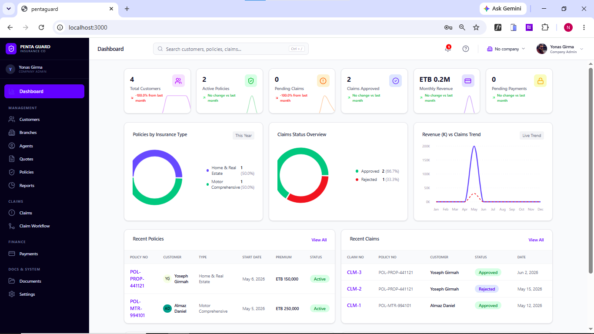
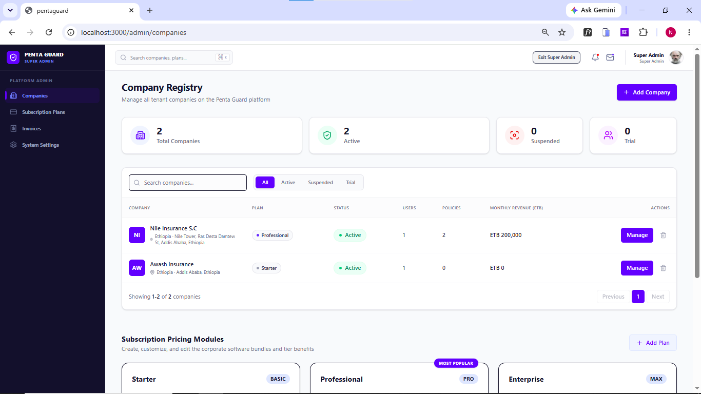
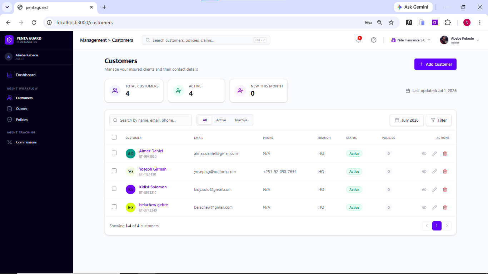
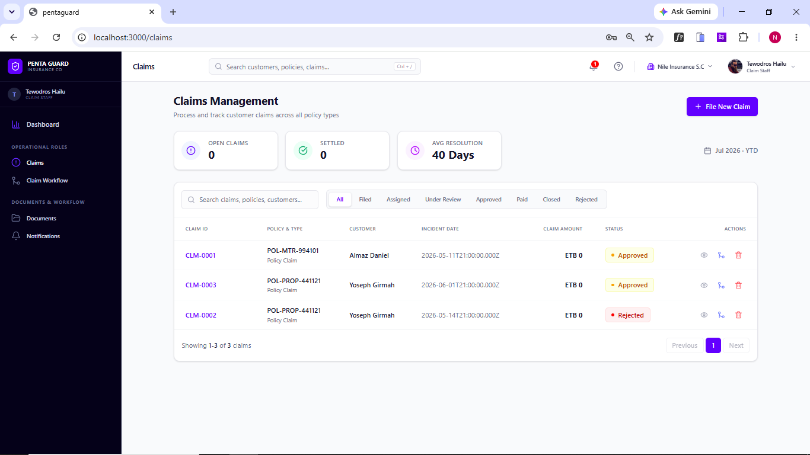

# Pentaguard

A SaaS insurance management platform built with React and Express. Supports multi-tenant companies, role-based access, claims workflow, payment scheduling, agent performance tracking, and audit logging.

## Features

- **Dashboard & Analytics** — KPI cards, 12-month trend charts, sparklines, revenue tracking
- **Customer Management** — CRUD with phone, address, Fayda ID
- **Policy Management** — Multi-type policies (auto, home, etc.), payment schedules, premium tracking
- **Claims Management** — Full workflow engine (file → review → approve/reject → pay), status tracking
- **Agent & Branch Management** — Performance metrics, commission tracking, hierarchical org structure
- **Quotes & Underwriting** — Quote generation, conversion to policies
- **Payment Processing** — Payment tracking, schedules, invoices
- **Subscription & Billing** — Plan management, invoice generation, multi-tenant billing
- **Document Management** — Upload tracking per policy/claim
- **Notification System** — Multi-channel (Email, SMS), message history
- **Role-Based Access** — `super_admin`, `admin`, `agent`, `claim_staff` with per-entity permissions
- **Global Search** — Cross-entity search across customers, policies, and claims
- **Audit Logging** — All CRUD operations recorded with user, IP, and details
- **Authentication** — JWT access + refresh tokens, httpOnly cookies, token blacklisting
- **Multi-Tenant** — Company-scoped data with isolation

## Tech Stack

| Layer | Technology |
|-------|-----------|
| Frontend | React 19, TypeScript, Vite 6, Tailwind CSS 4, React Router 7 |
| Charts | Recharts |
| UI/Icons | Lucide React, Motion (Framer Motion), clsx + tailwind-merge |
| Backend | Express 4, TypeScript, esbuild |
| Database | PostgreSQL 16 (with in-memory simulated engine for development) |
| Auth | JWT (jsonwebtoken), bcryptjs |
| Validation | Zod |
| Security | Helmet, express-rate-limit, CORS |
| Dev Tools | tsx (hot reload), concurrently, dotenv |

## Screenshots

|  |  |
| **Agent Dashboard** | **Claim Dashboard** |
|  |  |

